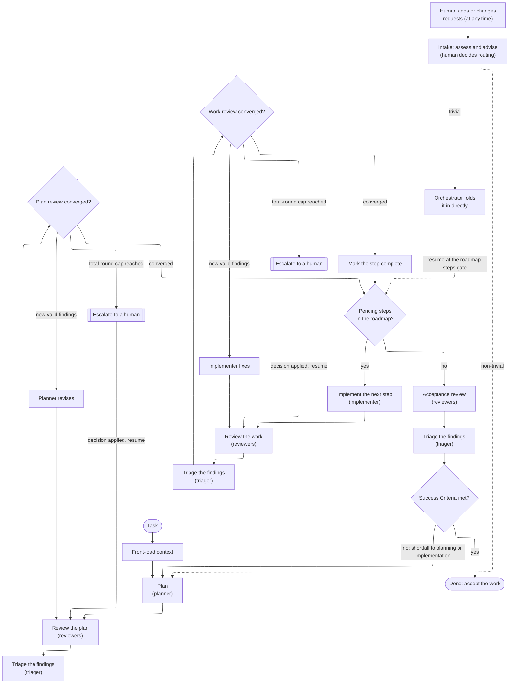

# agent-scaffold

[](https://crates.io/crates/agent-scaffold) [](https://github.com/nothingnesses/agent-scaffold/blob/main/LICENSE)

A small command-line tool that scaffolds a repeatable agent workflow into a project: front-load context, write a structured plan, review it, implement in small steps, then review the work. It drops a canonical `AGENTS.md`, a planning-document template, and a few reusable prompts, so the structure does not have to be hand-rolled for every repository.

## Motivations

- Setting the workflow up by hand for each project is repetitive: the same planning skeleton, the same guidance and principles, the same reusable prompts. This tool drops them in one command.
- It works both for a new project and for adding to an existing one. Scaffolding into a populated repository never clobbers your files: tool-owned reference assets under `.agents/` are refreshed, while working files (the root `AGENTS.md` and plan templates) are created only if absent unless you pass `--force`.
- The default is minimal. You get a usable core; anything extra is opt-in.
- Guidance is harness-agnostic. `AGENTS.md` is the canonical file, and any harness-specific file (for example `CLAUDE.md`) should point at it rather than duplicate it.

## What it scaffolds

Running the tool writes this layout into the target directory:

```
AGENTS.md                          canonical agent guidance (working file)
docs/plans/TEMPLATE.md             planning-document template (working file)
.agents/
  AGENTS.reference.md              pristine copy of the guidance, to merge from
  principles.toml                  the principle data the guidance renders
  prompts/                         role prompts and the planner's decision gates
    orchestrator.md                drive the workflow and the review loop
    planner.md                     draft the plan
    clarifying-questions.md        gate: agent asks, the human answers, before starting
    open-questions-gate.md         gate: agent presents options, the human chooses
    reviewer.md                    adversarially review the plan or the work
    triager.md                     adjudicate the review findings
    implementer.md                 implement the plan
  user-prompts/                    prompts a human copies and pastes to drive work
    kickoff.md                     start a new task under the workflow
    compaction-prep.md             flush durable state before a compaction
    resume.md                      continue an in-progress task after context loss
```

`AGENTS.md` is generated by rendering a selected set of principles into the guidance template. The `.agents/` assets are tool-owned and refreshed on every run; the working files are created once and then left alone (so your edits are safe) unless `--force` is given.

## How it's used

agent-scaffold is used at two moments, by two audiences:

- You (the human) run it once to set a project up. Choose which principles apply (in the selector, or with `--principles`), review the plan, and write the assets, then commit them to version control. To then start a task, see the "Getting started, for the human" section of the scaffolded `AGENTS.md`, which points you at the kickoff prompt to copy and explains your ongoing part in the decisions the workflow brings back to you.
- Agents then work inside the scaffolded project. They read `AGENTS.md` (the canonical, harness-agnostic guidance) and follow the workflow it describes: front-load context, draft a plan under `docs/plans/`, review the plan, implement in small steps, then review the work. The workflow separates roles (an orchestrator drives it, with a planner, independent reviewers, a separate triager, and an implementer), and `.agents/prompts/` carries one prompt per role. Agents consume these assets; they do not normally run the tool.

The tool's job ends at dropping well-structured assets: it sets the workflow up but does not enforce it at runtime. Adherence comes from agents following `AGENTS.md`.

The workflow the scaffolded `AGENTS.md` prescribes (an orchestrator drives every phase and keeps the review ledger). Each review loops until it converges; implementation iterates over the plan's steps; and the work stops only once every step is done and an acceptance review confirms the Success Criteria. Escalating to a human is a request for a decision (the workflow resumes at the paused review after it), not a stop; and a human may add or change requests at any time, which are assessed at intake and, when non-trivial, re-enter through the plan:



## Installation

agent-scaffold is a standalone Rust binary that runs without Nix. Install the latest release from crates.io:

```sh
cargo install agent-scaffold
```

Or build from source with a recent Rust toolchain (Rust 1.88 or newer):

```sh
git clone https://github.com/nothingnesses/agent-scaffold
cd agent-scaffold

# Install the `agent-scaffold` binary into ~/.cargo/bin:
cargo install --path .

# ...or just build it and use the produced binary:
cargo build --release
# ./target/release/agent-scaffold
```

If you use Nix, a development shell with the pinned toolchain and helpers is provided by the flake:

```sh
nix develop        # or: direnv allow, if you use direnv
```

## Usage

Every action is a subcommand. Bare `agent-scaffold` (with no subcommand) prints the list of subcommands and exits; scaffolding runs under the `scaffold` verb.

Writes are off unless confirmed, and a scaffold run always prints a plan of what it would do (one line per asset: `create`, `refresh`, `skip (exists)`, or `overwrite`).

On an interactive terminal, running `agent-scaffold scaffold` with no flags opens the two-pane selector; choosing Save in its confirmation modal writes the scaffold (Cancel or quit writes nothing). For non-interactive use:

- `--write` applies the changes directly (using `--principles`), skipping the selector. Off a terminal, this is the only way writes happen.
- `--dry-run` prints the plan and exits without writing and without opening the selector.
- With no flag and no terminal (a pipe or CI), it prints the plan and writes nothing.

Open the selector for the current directory:

```sh
agent-scaffold scaffold
```

Apply directly, without the selector (into a specific directory):

```sh
agent-scaffold scaffold --output-dir path/to/project --write
```

Re-running is safe and idempotent: reference assets are refreshed and existing working files are left untouched. Pass `--force` to overwrite working files too (`--force` decides overwrite-versus-skip; `--write` decides whether to write at all, so the two combine).

By default it also initialises an empty git repository in the output directory (like `cargo new`); pass `--vcs none` to skip that. It shows up in the plan and runs only on write; if the directory is already inside a git repository it is skipped (so scaffolding into a subdirectory of an existing repo does not nest a new one), and the repository is left empty (committing the scaffolded files is up to you).

### Choosing principles

`--principles` takes a comma-separated list of tokens:

- `default`: the sensible default subset.
- `all`: every principle in the pack.
- `none`: no principles.
- `tag:<name>`: every principle carrying that tag (for example `tag:fp`).
- a bare id: that one principle.

Tokens combine and are de-duplicated by first occurrence, so a bare id list keeps its order.

```sh
# List the default principles and exit, without scaffolding:
agent-scaffold scaffold --list-principles

# List every principle:
agent-scaffold scaffold --principles all --list-principles

# Scaffold a specific, ordered selection:
agent-scaffold scaffold --principles kiss,verify-dont-trust,tag:fp
```

`--principle-detail` controls how much of each principle is rendered: `name`, `summary` (the default), or `full` (name, rationale, and references).

### Interactive selection

On a terminal, `agent-scaffold scaffold` opens the two-pane selector by default (seeded from `--principles`); pass `--write` or `--dry-run` to skip it:

- Left pane lists available principles; right pane lists the included ones in order.
- `i` / `a` move the highlighted principle to the other pane, inserting it before (`i`) or after (`a`) the cursor.
- `Tab` / `h` / `l` / arrow keys switch focus; `j` / `k` or the arrows move the cursor; `K` / `J` reorder within the included pane.
- `u` / `U` undo and redo; `/` filters the available pane by name, id, or tag.
- `Enter` opens a save-confirmation modal (defaulting to Cancel so nothing is written by accident); `q` aborts.

On save it prints a ready-to-paste `--principles <ids>` line so the exact selection and order can be replayed non-interactively.

### Validating and projecting workflow state

Two read-only subcommands inspect the state a running workflow keeps (they never write anything).

`validate` checks the workflow's metrics log against its record schema and, with `--plan`, the plan's structured regions (the Roadmap table and the Open Questions queue) against the plan schema. It reports every malformed record or region and exits non-zero if any exist, so it can gate a commit or run in CI:

```sh
# Validate the default metrics log (docs/metrics/workflow.jsonl):
agent-scaffold validate

# Also validate a plan's Roadmap and Open Questions structure:
agent-scaffold validate --plan docs/plans/my-task.md
```

`status` prints a best-effort projection of that state: the plan's Roadmap steps grouped by status and its Open Questions count, plus a metrics-record count. Unlike `validate` it never fails on a missing or malformed file (a missing part is simply left out of the projection), and `--json` emits the projection as JSON for another tool to consume:

```sh
# Human-readable summary:
agent-scaffold status --plan docs/plans/my-task.md

# Machine-readable projection:
agent-scaffold status --plan docs/plans/my-task.md --json
```

## Bring your own pack

By default the tool uses its built-in pack. Point `--template` at a directory to scaffold from your own pack instead:

```sh
agent-scaffold scaffold --template path/to/my-pack --var project=my-service
```

A pack is a directory with a `pack.toml` manifest that declares its assets and any variables:

```toml
# Each asset: where its source file lands, whether it is a tool-owned reference
# asset or a user working file, and whether it is rendered or copied verbatim.
# One source may map to several assets.
[[asset]]
source = "AGENTS.md"
dest = "AGENTS.md"
ownership = "working"    # "working" (create-if-absent) or "reference" (refreshed)
render = true            # substitute {{variables}}; omit or false to copy verbatim

[[asset]]
source = "principles.toml"
dest = ".agents/principles.toml"
ownership = "reference"

# Variables the pack's rendered assets can reference as {{name}}.
[[var]]
name = "project"
default = "my-project"   # optional; omit `default` to make the variable required

[[var]]
name = "author"          # required: must be supplied with --var author=...
```

Rendering does minimal `{{name}}` substitution (there is no template engine). `{{principles}}` and `{{instrument}}` are built-in variables the tool computes itself; both are reserved, so a pack may neither declare them nor set them with `--var`. `{{principles}}` is computed from the selection. `{{instrument}}` is filled from the pack's optional `instrument.md` render fragment when `--instrument` is set (empty otherwise); like `principles.toml`, that fragment is read directly and inlined, not dropped as its own asset. Setting a variable the pack does not declare, or leaving a required variable unset, is an error and nothing is written.

### Optional modules

A pack can group opt-in extras into named modules. Declare each module in a `[[module]]` section, then tag the `[[asset]]` and `[[var]]` entries that belong to it with `module = "<name>"`:

```toml
# Each module names itself and describes what it adds. This section is the
# authoritative list of known module names.
[[module]]
name = "diagrams"
description = "Adds a diagram template and the variable it renders."

# An asset tagged with a module is dropped only when that module is selected.
[[asset]]
source = "diagram.md"
dest = "docs/diagram.md"
ownership = "working"
render = true
module = "diagrams"

# A variable tagged with a module is only in play when that module is selected.
[[var]]
name = "diagram_title"
module = "diagrams"      # required here, but only demanded when `diagrams` is selected
```

An entry with no `module` tag is core: it is always applied. A tagged entry is applied only when you select its module with the repeatable `--module <name>` flag (`agent-scaffold scaffold --module diagrams`). With no module selected, every tagged asset is dropped and every tagged variable is skipped entirely: its default does not apply, it is not required, and a `--var` naming it is rejected as undeclared, exactly as if the pack never declared it. A selected module's variables behave like core ones (a default applies, or the variable is required if it has none). Because core output does not depend on any module, scaffolding with no `--module` is byte-identical to a pack that declares no modules at all.

Every module a tag references, and every `--module` you pass, must be declared in a `[[module]]` section, and each module name must be declared only once. An unknown `--module`, a tag naming a module no `[[module]]` declares, or a duplicated `[[module]]` name is an error, and nothing is written.

Principles are a property of the pack: if your pack ships its own `principles.toml`, `--template` selects and renders from that set rather than the built-in one. A pack that ships no `principles.toml` simply has no principles to select.

## Development

The repository uses Nix, direnv, and just. Common tasks:

```sh
just build     # cargo build
just test      # cargo test
just clippy    # cargo clippy --all-targets
just fmt       # format all files through the Nix formatter
just run -- --help
```

The verification convention before each commit is `cargo clippy --all-targets -- -D warnings`, `nix fmt`, and keeping all text ASCII-clean.

## License

This project is licensed under the [Blue Oak Model License 1.0.0](LICENSE).
